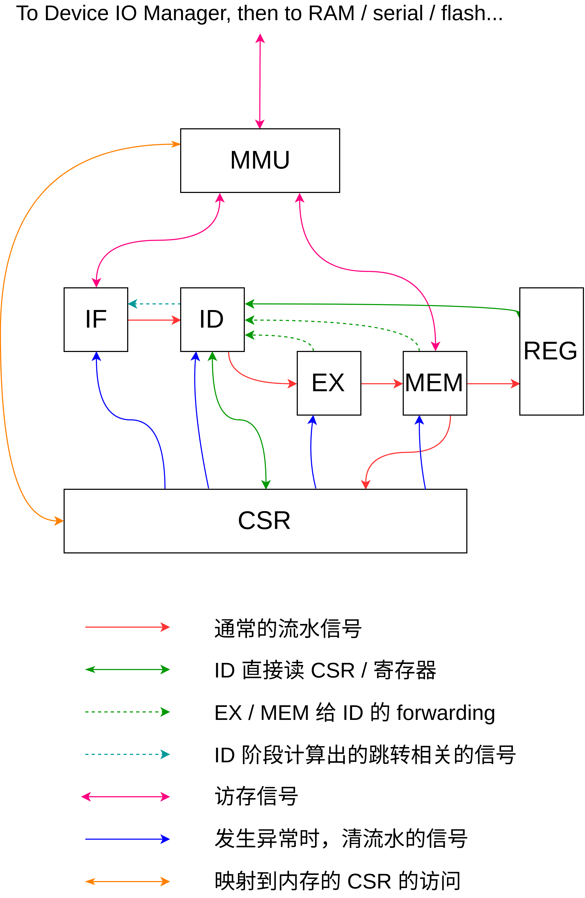
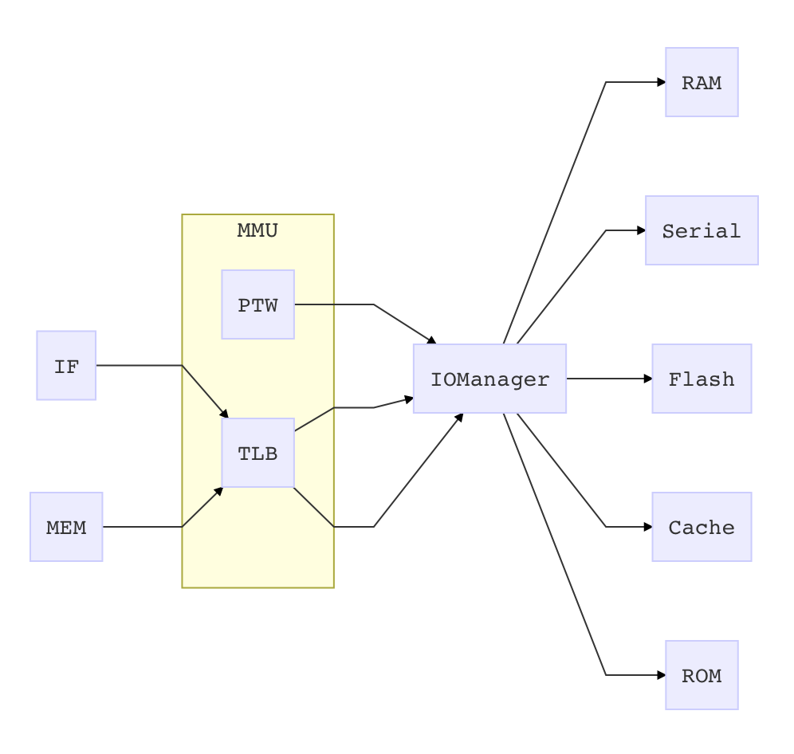

# 计算机系统综合实验报告

计53 张耀楠 戴臻旸 王润基

2018.08.02

---

### 实验目标

以RISCV32为核心：

* 编译：将Decaf编译器后端移植到RISCV
* OS：将RustOS移植到RISCV
* CPU：实现支持RV32I标准的单核CPU

---

### 时间安排

第一周：
* 学习研究RISCV和工具链。
* 完成Decaf后端的移植。
* 开始RustOS移植。

第二周：
* 完成RustOS移植。
* 继续学习使用Chisel语言以及相关工具。
* 完成基本的五段流水。

后三周：
* CPU实现和调试。
* 完善 Decaf。

---

### 实验结果：编译

  * 完成从 MIPS 后端到 RV32I 后端的移植
  * 使用 C 实现简单的一个运行库，以 Decaf 生成代码和运行库链接生成可执行文件
  * 通过编译 PA4 测试
  * 可在QEMU上以riscv-pk、uCore、RustOS为后端运行，以及在板子上 bare metal 环境中运行

---

### 实验结果：OS

  * 之前x86上已实现的功能都移植到RISCV32，并可正常运行。
  * 之前没有实现的部分平台无关功能（文件系统）由于时间原因也没有实现。

---

### 实验结果：CPU

  * 实现了经典五段流水CPU
  * 尝试新的访存时序，达成50MHz主频，“超流水”
  * 可在板子上正常运行SystemOnCat组提供的监控程序
  * 距离运行OS“近在咫尺”：MMU，CSR基本完成
  * 正在持续Debug以通过官方[riscv-tests](https://github.com/riscv/riscv-tests)的测例

---

## Decaf

* 生成 RiscV 的汇编代码
* 移植 Decaf 的内置函数如 `Print`, `new`　等

---

### Decaf 后端代码生成

1. 对中间代码 TAC 做数据流分析．
2. 利用第一步的结果，完成寄存器分配，将 TAC 中有无限个的虚拟寄存器变成物理寄存器．
3. 使用目标架构的指令完成 TAC 需要的操作，如 TAC 的 `ADD` 对应 RiscV 指令 `addi` 和 `add`.

简单，但优化能力不足

---

### 生成汇编代码

1. 将代码中 Mips 全都改成 Riscv
2. 修改寄存器: 主要是改名
3. 修改一些指令的实现．
如 Riscv 没有 `slt r1, r2, r3` 指令．
最简单的方法就是把它变为 `sub r1 r2 r3; snez r1`.

可以看出，改动相对较小．
我们认为这是因为 Riscv 天生就和 Mips 非常相似的缘故，
毕竟它们都是 Patterson 那帮人设计的．

---

### 运行时

如何方便地实现 Decaf 语言自带的 `Print`, `new` 等函数呢？

**使用 C 语言实现一个函数库．Decaf 生成的汇编代码和这个函数库最后链接即可．**

针对三种平台（riscv-pk，rucore，baremetal）各实现了一套库函数

---

### 遇到的挑战

* 调试 rucore 时, mksfs 生成的镜像总是无法正确运行. 后来发现, 我使用了 x86-64 的 ucore. 换到 riscv ucore 之后即可.
* 调试 baremetal 环境下时, 串口一直无输出. 后来和队友沟通发现, 是因为串口模式不对, 改为 CPLD 控制的串口之后即可.

---

## RustOS

将RustOS从x86_64移植到RISCV32

可以在QEMU模拟器中运行全部功能，没能在板子上跑起来。

---

### 开发环境，的坑

由于riscv-rust工具链新鲜出炉，尚有一些不完善之处：
* 不使用M扩展，发生链接错误——使用M扩展。
* LLVM后端不完全支持A扩展——修改Rust核心库
* LLVM后端不支持某些结构体的生成——修改结构体定义
* 不支持RV64

（要不是它发布了一个编译好的工具链，这事儿八成就凉了）

---

### 移植过程

参考[bbl-ucore](https://github.com/ring00/bbl-ucore)及后续的[ucore_os_lab for RV32](https://github.com/chyyuu/ucore_os_lab/tree/riscv32-priv-1.10)

移植过程比较顺利，仅用两周完成

在此对张蔚和石振兴的开创性工作表示感谢！

---

#### 遇到问题举例：页表自映射 

RISCV下的页表规范阻碍了自映射的实现

解决办法：在访问一级页表虚地址期间，将它所对应的二级页表项flags置为VRW

---

### 移植总结

* 始终保持x86版本正常运行，项目完整统一。
* 直接使用社区的riscv库，并为之做了补充。

* 跨平台需求促成了代码分离和模块化。

代码量统计：
* RISCV平台相关部分，不含riscv库：~500行
* x86_64平台相关部分，不含x86_64库：~1800行
* 内存管理模块：~1000行
* 线程管理模块：~600行
* 文件系统部分：~1000行
* Kernel其它部分：~1200行
* 共计：6000+行

---

## CPU

使用 Chisel 编码了实现 RV32I 的 CPU。
使用 Verilog 实现外部设备的底层控制。

---

### 大体架构

传统五段流水线，的每段流水一个模块



---

### 访存相关

* 经过软件仿真正确之后，CPU在板子上的唯一不确定因素
* 访存速度不够，加上前后大量的组合逻辑延迟，导致主频降低

---

考虑到这些，我们本次造的CPU进行了全新的尝试：

#### 异步IO

**对RAM和串口的读写操作都要等到下一个时钟上升沿才被接受，并在下个周期写入/读出数据**

---

访存接口增加了ok信号，表示访存操作是否在当前周期执行完毕

```scala
class RAMOp extends Bundle {
  val addr  = Output(UInt(32.W))	// 访存地址
  val mode  = Output(UInt(4.W))		// 访存模式
  val wdata = Output(UInt(32.W))	// 写数据
  val rdata = Input(UInt(32.W))		// 读数据
  val ok    = Input(Bool())	// 操作在当前周期执行完毕？
    
  // Can accept a new IO request next cycle ?
  def ready = mode === RAMMode.NOP || ok
}
```

---

对于访存设备，允许它在0~任意长的周期内完成IO操作。
例如Cache命中是0周期，RAM和串口是1周期，Flash是多周期。

对于访存用户，导致它们都必须维护内部状态，但同时也促成了它们之间的解耦合。

一次访存请求必须是**阻塞调用**，即在设备给出ok信号前，用户应保持输入且无法中止此次操作。

---

成效显著：

**我们的CPU可以跑在50MHz主频上**

**在没有Cache的情况下自动以25MHz的速度处理指令**

**只要Chisel仿真通过，那么上板也一定没问题**

---

#### IO层次结构

访存流程：

* 用户给出访存请求，用虚地址表示
* 输入TLB查询实地址
  * 若miss，进入PTW读页表流程
  * 若PageFault，直接返回错误
* 根据实地址，转发请求到具体的设备
* 待设备给出结果后，将响应送回原始请求方

---



---

### CSR与特权相关

两个比较大的问题：

1. 当前特权级应该保存在哪里？
借鉴第一组做法，新建内部寄存器。

2. 如何维护mtimecmp寄存器？内存映射 or CSR？
参考第一组做法（自定义映射地址），但不借鉴
使用CSR，在OS中绕过bbl直接访问之。

---

### 中断/异常

实现精确异常，所有的异常都到最后再处理。

IF -> ID -> EX -> MEM 层层传递。

CSR通知各模块清流水。

xRet和Fence统一用内部异常实现。

---

### 遇到的挑战

- Chisel入门门槛较高：参考riscv-mini学习如何实现CPU
- Chisel测试框架涉及Scala及其构建系统sbt的相关内容
- Chisel测试框架无法检查内部状态，不如看波形方便

---

### 测试方法

完善的测试环境太重要了！

Chisel相比VHDL/Verilog，写起测试来灵活度不知高到哪里去了。

在我们项目的不同阶段，尝试过不同的测试方法：

- 各模块单元测试
- 引出并检查CPU内部状态
- MockDevice
- 检测特定寄存器/内存的值，判断测试通过或失败
