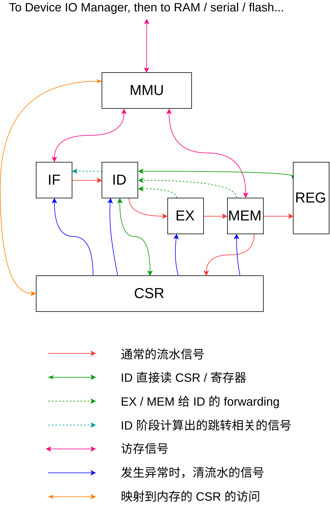

# 计算机系统综合实验报告

计53 张耀楠 戴臻旸 王润基

2018.08.01

## 实验概况

### 实验目标

以RISCV32为核心，分别实现编译器、OS移植、CPU，并以CPU为主要任务。

* 编译：将Decaf编译器后端移植到RISCV
* OS：将RustOS移植到RISCV
* CPU：实现支持RV32I标准的单核CPU

### 时间安排

共5周：

第一周：学习研究RISCV和工具链。完成Decaf后端的移植。开始RustOS移植。

第二周：完成RustOS移植。继续学习使用Chisel语言以及相关工具，完成基本的五段流水。

后三周：CPU实现和调试，完善 Decaf。

### 实验结果

* 编译：
  * 完成从 MIPS 后端到 RV32I 后端的移植
  * 使用 C 实现简单的一个运行库，以 Decaf 生成代码和运行库链接生成可执行文件
  * 通过编译 PA4 测试
  * 可在QEMU上以riscv-pk、uCore、RustOS为后端运行，以及在板子上 bare metal 环境中运行
* OS：
  * 之前x86上已实现的功能都移植到RISCV32，并可正常运行。
  * 之前没有实现的部分平台无关功能（文件系统）由于时间原因也没有实现。
* CPU：
  * 实现了经典五段流水，50MHz主频的CPU
  * 可在板子上正常运行SystemOnCat组提供的监控程序
  * 正在持续改进以通过官方[riscv-tests](https://github.com/riscv/riscv-tests)的测例

## Decaf
Decaf 的工作分为两部分，
一个是生成 RiscV 的汇编代码，这个是编译的要求．
另一个是移植 Decaf 的内置函数如 `Print`, `new`　等．

### Decaf 后端代码生成
Decaf 框架中，后端代码生成的流程是
1. 对中间代码 TAC 做数据流分析．
2. 利用第一步的结果，完成寄存器分配，将 TAC 中有无限个的虚拟寄存器变成物理寄存器．
3. 使用目标架构的指令完成 TAC 需要的操作，如 TAC 的 `ADD` 对应 RiscV 指令 `addi` 和 `add`.

这方法最大的问题是优化能力不足（实际上 Decaf 可以说唯一的优化就是死代码删除）．
数据流分析止步于单个基本块．
每次离开基本块都需要保存变量到内存，进入基本块又需要加载变量到寄存器．
最大的优点在于简单，最后每条 TAC 对应的是确定的汇编指令串．

### 生成汇编代码
为了使得 Decaf 框架生成 Riscv 汇编代码，我们做了如下的改动

1. 将代码中 Mips 全都改成 Riscv

2. 修改寄存器: 主要是改名

3. 修改一些指令的实现．如 Riscv 没有 `slt r1, r2, r3` 指令．
最简单的方法就是把它变为 `sub r1 r2 r3; snez r1`.

可以看出，改动相对较小．
我们认为这是因为 Riscv 天生就和 Mips 非常相似的缘故，
毕竟它们都是 Patterson 那帮人设计的．

### 运行时
生成的汇编代码还无法运行，因为他们还缺乏 `Print` `new` 等函数的实现，
如何方便地实现 Decaf 语言自带的 `Print`, `new` 等函数呢？

一种方法是采用汇编编写，然后把汇编代码硬编码入 Decaf 代码生成框架．
但是这样不仅会遇到汇编代码难以编写的问题，更重要的是函数实现的变化变得非常繁琐．

我们采用的方法是，使用 C 语言实现一套 `Print`, `new` 等，相当于一个函数库．
Decaf 生成的汇编代码和这个函数库最后链接即可．实际使用中这套方法非常有效，
我们针对三种平台（riscv-pk，rucore，baremetal）各实现了一套库函数，
这样我们的 Decaf 程序只需要和不同的库链接，就能运行在不同的平台上．

另外，因为 Decaf 框架和 Riscv 标准的 ABI 有不同，
如 Decaf 用 x86 式的栈传参，而 Riscv 使用寄存器传参，
因此我们还是要在后端框架中包装一下库函数．
不过这个包装只是把参数从栈上读进寄存器，然后就调用库函数执行具体的功能了．

### 测试运行
Decaf 相关代码在 [github](https://github.com/riscv-and-rust-and-decaf/decaf-riscv-compiler) 上．
后端生成的测试在 `decaf-riscv-compiler/TestCases/{rv,wrjlibc,baremetal}` 中．

* **riscv-pk 环境下测试**: 在 `TestCases/rv` 下运行 `./testall` 即可. 需要预先安装 riscv-tools.
可以使用我们的编译好的版本 [riscv-tools](https://github.com/riscv-and-rust-and-decaf/riscv-prebuilt-toolchains/releases).
下载后需要将 `bin` 加入 `$PATH` 中.

* **rucore 环境下测试**: 执行如下命令
```
TestCases/wrjlibc $ HAS_LIBC=0 BAREMETAL=0 make
TestCases/wrjlibc $ cd ../rv
TestCases/rv $ HAS_LIBC=0 BAREMETAL=0 make exe
```
然后选择你希望运行的可执行文件, 利用 `mksfs` 放入 riscv-ucore 的磁盘中, 启动 riscv-ucore / rucore 就应该可以看到该程序了, 运行即可.

* **baremetal 环境下测试**: 执行如下命令
```
TestCases/wrjlibc $ HAS_LIBC=0 BAREMETAL=1 make
TestCases/wrjlibc $ cd ../baremetal
TestCases/baremetal $ make
```
然后将希望运行的 `.bin` 文件烧入 baseram 从 0 开始的位置, 再烧入 CPU 的 `.bit` 文件,
重置后应当在串口看到输出.

如果 `make` 在链接阶段出错, 检查 `wrjlibc` 是否使用了正确的 `HAS_LIBC` 和 `BAREMETAL`.

### 遇到的挑战
* 调试 rucore 时, mksfs 生成的镜像总是无法正确运行. 后来发现, 我使用了 x86-64 的 ucore. 换到 riscv ucore 之后即可.

* 调试 baremetal 环境下时, 串口一直无输出. 后来和队友沟通发现, 是因为串口模式不对, 改为 CPLD 控制的串口之后即可.

## RustOS

这部分由王润基负责。[GitHub](https://github.com/wangrunji0408/RustOS)，[简单日志](http://os.cs.tsinghua.edu.cn/oscourse/csproject2018/group05#RustOS)。

在2018春操作系统大实验上，我参考uCore实现了Rust版本的简易OS，目标平台是x86_64。作为此项目的后继任务，以及本次综合实验的一个子任务，目标是将RustOS移植到RISCV32。

实验结果是可以在QEMU模拟器中运行全部功能。但由于CPU进度未达预期，没能在板子上跑起来RustOS。

### 开发环境

- [riscv-rust/rust](https://github.com/riscv-rust/rust)：使用[官方发布的二进制版本+源码](https://github.com/riscv-rust/rust/releases/tag/riscv-rust-1.26.0-1-dev)
- [riscv-gnu-toolchain](https://github.com/riscv/riscv-gnu-toolchain)：使用OS2018腾讯云中使用的预编译版本

上述依赖已经打包制成Docker，编译运行方法详见README。

由于riscv-rust工具链新鲜出炉，尚有一些不完善之处：

* 如不使用M扩展，编译器会尝试自动链接内置软乘除法函数，而有的函数没有实现，造成链接错误。

  解决方案：使用M扩展。

* LLVM后端不完全支持A扩展。

  解决方案：修改Rust核心库，将相关操作改用关中断实现。

* LLVM后端不支持某些特定结构体的生成（观察都是<4bytes的）

  解决方案：修改结构体定义，绕开问题。

* 整套工具链还不支持RV64。

### 移植过程

整个过程基本参考[bbl-ucore](https://github.com/ring00/bbl-ucore)及后续的[ucore_os_lab for RISCV32](https://github.com/chyyuu/ucore_os_lab/tree/riscv32-priv-1.10)。由于RustOS本身就是参考uCore实现，加上bbl-ucore的文档足够详尽，移植过程比较顺利，仅用两周完成。在此对张蔚和石振兴的开创性工作表示感谢！

以下仅对遇到的新问题展开描述：

#### 1. Kernel虚实地址

bbl-ucore使用RISCV1.9的bbl，ucore_os_lab使用RISCV1.10的bbl。后者相比前者，去掉了对内核的内存映射，因此需保证虚实地址一致。

事实上ucore_os_lab中的虚实地址并不一致，且没有内存映射，但依然能够运行，应该是由于编译器生成的所有跳转都使用相对偏移。而Rust编译器会生成绝对地址跳转，因此若虚实不一致会导致非法访存。

解决方案是调整linker script，使虚实地址一致。

#### 2. 页表自映射 

原x86_64版本使用页表自映射完成修改页表本身的操作。但**RISCV下的页表规范阻碍了自映射的实现**。原因是RISCV页表项中的flags，明确表示它指向的是数据页（VRW），还是下层页表（V）。假如把一个二级页表项，当做一级页表项来解读，就会触发异常。而这是自映射机制中必须的操作。

为了绕开这个问题，就要求**在访问一级页表虚地址期间，将它所对应的二级页表项flags置为VRW**。此外，为了访问二级页表本身，还需要再加一个自映射的二级页表项，其flags为VRW。

### 移植总结

移植开始时，首先利用条件编译将全部代码禁用掉，然后逐步加入平台特定代码、恢复平台无关代码。由于当初只需面向一个平台，尽管设计时已经对跨平台有所考虑，但真正开始移植时，还需要做很多代码分离、抽出接口的工作。整个过程中，我始终保持x86版本要能正常运行，维持一个完整项目。

得益于Rust的包管理系统，社区中已经有了[riscv库](https://github.com/riscv-rust/riscv)可以直接使用。我为其补充了OS所需的S-Mode指令，并从[x86_64库](https://github.com/rust-osdev/x86_64)借鉴并移植了页表模块。[Fork之后的版本](https://github.com/riscv-and-rust-and-decaf/riscv)日后经过完善也许可以提个PR贡献回去。

在跨平台需求的促进下，我基本实现了上学期提到的【从内核中分离出内存管理模块和线程管理模块】的想法，并实现了平台相关与无关代码的分离。最后经过统计，各部分代码量为：

* RISCV平台相关部分，不含riscv库：~500行
* x86_64平台相关部分，不含x86_64库：~1800行
* 内存管理模块：~1000行
* 线程管理模块：~600行
* 文件系统部分：~1000行
* Kernel其它部分：~1200行
* 共计：6000+行

较好地实现了模块化与保持精简的设计初衷。

关于OS的具体实现细节，待我日后再去补文档吧……

## CPU
我们组使用 chisel 编码了实现 RV32I 的 CPU，使用 Verilog 实现外部设备的底层控制。

CPU 的 chisel 代码在 [github](https://github.com/riscv-and-rust-and-decaf/riscv32i-cpu-chisel),
涉及具体上板子需要的 Vivado 工程以及一些外设的底层控制代码在 [github](https://github.com/riscv-and-rust-and-decaf/riscv32i-cpu).

### 大体架构
我们组在设计 CPU 的过程中，没有采用 Rocket / mini 的那种 Datapath + Control 的方式，而是使用了更加传统的每段流水一个模块的方式。
在 CPU 内部，各个模块之间的关系如下图所示



### 五段流水
RISC 的五段流水算是经典架构，所以相关背景略去。

我们的实现中，五段流水通过 `IF`， `ID`， `EX`， `MEM` 模块实现。最后的 `WB` 隐含在其他模块如 `REG` 中。

每个部分的职责和计原课程中的基本一样所以不再赘述。

*TODO: 是否要加入每个模块的职责？虽然我认为这已经被叙述过无数次*

### 访存相关
相对于计原课程，本课程我们多实现了一个硬件完成的 TLB 重填。
为此需要实现硬件访问页表的功能，通过 `PageTableWalker` 模块完成。

### 遇到的挑战
* 从 chisel 的入门引导文档到我们设计的 CPU 之间有很大的差距, 光看入门文档难以熟悉 chisel 语言. 我们选择了简单的 riscv-mini, 最开始阅读 riscv-mini 的实现来学习 CPU 实现中的一些写法.

* 我们没有 scala 及其构建系统 sbt 的使用经验. chisel 中有很多用法都涉及到了相关内容, 尤其是测试框架那一部分. 解决办法: 未很好解决. 前期基本上没有使用 scala 的高级特性, 后期稍微熟悉后可以使用一些如 `implicit` 等语言特性.

* chisel 的仿真测试只能检测输入输出信号, 无法检查内部状态. 如果想要检查内部状态, 就需要在相应的元件中加入 `printf`, 不如看波形方便.

### CSR与特权相关

CSRs(Control and Status Registers)是一组管理和记录硬件状态的寄存器。监控程序不涉及CSR，但特权级切换、中断异常的处理等都和CSR密切相关。

目前最新版本的文档(v1.10)中，riscv有三个特权级(曾经有4个)，分别为U(ser/Application),S(upervisor),M(achine)。CSR寄存器也基本分为U,S,M三类，对应不同的权限需求。

直接读写CSRs的指令为csr指令，共6条，分别为寄存器模式下和立即数模式下的完整写、某些位置1、某些位置0(均附带读)。指令需要原子地读和写CSR，因此在具体设计上，ID段读CSR，EX段计算(覆盖/置1/置0)，MEM之后写会，并新增了相应的旁路。并且，某些CSRs是只读的，某些CSRs某些位只读。

除了通过csr指令直接修改外，一些CSRs还需要硬件自行维护。例如mtime寄存器需要每个周期+1，mstatus寄存器在中断/返回时自行维护相应位的值。

CSR的设计过程中，遇到过两个比较大的问题。

一是不知道当前特权级应该保存在哪里。在较早版本的文档中，mstatus中有两位用来保存当前特权级，但在v1.10中mstatus各个位的含义有了较大变化，不再有直接保存当前特权级的位。最后，通过第一组的交流，我们采用了他们的做法，新建了一个两位的“内部”寄存器来维护当前特权级。

二是在处理时钟中断时，不知道应该如何维护mtimecmp寄存器。(mtime >= mtimecmp且相应开关开启时触发时钟中断)。按照最新的文档，mtimecmp应该内存映射，但是并没有给出具体的地址，也始终找不到相应标准。后来通过上网搜索、读bbl代码、参考riscv-mini代码、参考riscv-sodor等方法，均未能解决。其中riscv-mini是按照老版本，未做内存映射而是通过csr方式，riscv-sodor疑似并未正确实现时钟中断。通过与第一组交流，他们的方式是自行规定了一套映射的地址。但我们认为这样会导致混乱，OS无法在不同CPU上运行。

经过分析，我们认为之所以出现这个问题，是因为riscv本身还不稳定，版本迭代较快，有些标准缺乏或未写入文档。于是我们决定退回较老版本的标准，以csr方式写入mtimecmp，并在OS中做相应修改绕过bbl直接用汇编代码读写mtimecmp。当然，这实际上是一种标准混搭，严格说是不符合规范的，并且在使用新版本的riscv工具链时，汇编代码中的csr指令只有手动写入csr地址。

### 中断/异常

异常来自指令流本身，而中断来自“外部”(时钟中断形式上看是内部)。为了实现精确异常，所有的异常都到最后再处理。IF -> ID -> EX -> MEM 传递有无异常、细节、异常码。MEM向CSR模块连线，具体的中断/异常处理在CSR模块中实现。

CSR向各个阶段的"挡板"连线告诉它们是否要清流水，并额外向IF连线告诉它跳转地址。MEM阶段也要判断本条指令有无异常，是异常则清掉写寄存器、写MMU、写CSR等操作。

为了方便实现，xRet(x=U,S,M)和SFENCE.VMA也以异常的形式传递。

在CSR模块中，对于中断/异常再做具体的处理，修改特权级，修改mstatus，保存pc、异常码、细节到xepc、xcause、xtval，并根据xtvec和xcause的值告诉IF做相应跳转(x=U,S,M)。

异常通过流水逐段传递给CSR，而中断则是从Core外传递给CSR或在CSR内部产生(时钟中断)。同时有异常和中断时，优先处理异常。
