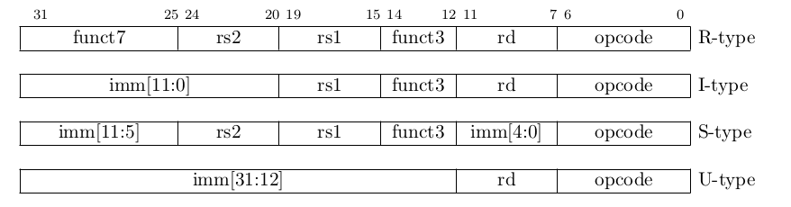

# RISC-V 指令集
只考虑 32 位的 risc-v.

## 指令模块
* 基本整数: RV32I
* 整数乘除: RV32M
* 原子操作: RV32A
* 浮点操作: RV32F, RV32D

------------------------------------------------------------------------------
# RV32I

标准 32 位指令的最低 5 位是 `bbb11`, 其中 `bbb != 111`.

## 寄存器
寄存器都是 32 位的.
* 32 个 GPR: `x0` 到 `x31`, 其中 `x0` 硬连线到 0.
* 用户可见的 `pc`. **特别注意, pc 指向当前指令而不是下一条指令**

## 指令
指令定长 32 位, 要求 4 字节对齐, 按照小端存储在内存中.

除了操作 CSR 的时候, 立即数都是符号拓展的.

### 整数指令
没有溢出异常.

* **寄存器-立即数指令**:
除非特别提到, 编码都是 I 类型.

| 指令名 | 含义                                                | 备注                                 |
| ---    | ---                                                 | ---                                  |
| addi   | rd = rs + se32(imm)                                 | 没有异常. se32 表示符号拓展到 32 位  |
| slti   | rd = ((signed) rs < (signed) se32(imm)) ? 1 : 0     |                                      |
| sltiu  | rd = ((unsigned) rs < (unsigned) se32(imm)) ? 1 : 0 | sltiu rd rs 1 用来比较 rs 是否等于 0 |
| andi   | rd = rs & se32(imm)                                 |                                      |
| ori    | rd = rs \| se32(imm)                                 |                                      |
| xori   | rd = rs ^ se32(imm)                                 | xori rs rs -1 用来实现 not rs rs     |
| slli   | rd = rs shl\_logic imm                              | imm 有 12 位, shamt 在最低 5 位      |
| srli   | rd = rs shr\_logic imm                              | 同上                                 |
| srai   | rd = rs shr\_arith imm                              | 同上                                 |
| lui    | rd = imm20 shl\_logic 12                            | U 编码                               |
| auipc  | rd = pd + imm20 shl\_logic 12                       | imm20 置为 0 可以得到当前 pc. U 编码 |

* **寄存器-寄存器指令**:
除非特别提到, 编码都是 R 类型.

| 指令名 | 含义                                           | 备注                                |
| ---    | ---                                            | ---                                 |
| add    | rd = rs1 + rs2                                 | 没有异常                            |
| sub    | rd = rs1 - rs2                                 | 没有异常                            |
| slt    | rd = ((signed) rs1 < (signed) rs2) ? 1 : 0     |                                     |
| sltu   | rd = ((unsigned) rs1 < (unsigned) rs2) ? 1 : 0 | sltu rd x0 rs2 用于 rd = (rs2 != 0) |
| and    | rd = rs1 & rs2                                 |                                     |
| or     | rd = rs1 \| rs2                                 |                                     |
| xor    | rd = rs1 ^ rs2                                 |                                     |
| sll    | rd = rs1 shl\_logic rs2                        | shamt 是 rs2 最低 5 位              |
| srl    | rd = rs1 shr\_logic rs2                        | 同上                                |
| sra    | rd = rs1 shr\_arith rs2                        | 同上                                |

* **跳转指令**:
除非特别说明, 都是用 B 指令编码格式.

| 指令名        | 含义                                                          |       备注                                    |
| ---           | ---                                                           | ---                                           |
| jal rd, imm20 | pc += (imm20 * 2) &&& rd = pc + 4                             | 编码 J 格式. 调用传统是 ra = r1, 另有备用 ra = r5.  jal x0 可以实现 j imm.  跳转地址未对齐则产生异常.  &&& 表示并行执行 |
| jalr          | pc = (se32(imm12) + rs1) & ~1 &&& rd = pc + 4                 | I 格式. lui + jalr 两条指令就可以跳转到任何地方 |
| beq           | (rs1 == rs2) ? pc += imm12 * 2 : nop                          | 跳转范围达 4 KB                               |
| bne           | (rs1 != rs2) ? pc += imm12 * 2 : nop                          | 跳转范围达 4 KB                               |
| blt           | ((signed) rs1 < (signed) rs2) ? pc += imm12 * 2 : nop         | 跳转范围达 4 KB                               |
| bltu          | ((unsigned) rs1 <= (unsigned) rs2) ? pc += imm12 * 2 : nop    | 跳转范围达 4 KB                               |
| bge           | ((signed) rs1 >= (signed) rs2) ? pc += imm12 * 2 : nop        | 跳转范围达 4 KB                               |
| bgeu          | ((unsigned) rs1 >= (unsigned) rs2) ? pc += imm12 * 2 : nop    | 跳转范围达 4 KB                               |

希望软件主要的指令路径是顺序的. 希望软件假设分支预测是 BTFN.
无条件跳转应当使用 `jal x0 imm20` 而非 `beq x0 x0 imm12`

* **访存指令**:
除非特别说明, 都是用 I 格式指令编码

| 指令名 | 含义                                     | 备注                                                         |
| ---    | ---                                      | ---                                                          |
| lw     | rd = * (int * ) (rs1 + imm12)            | 硬件应当支持未对齐访问. 未对齐访问允许非常慢, 允许是非原子的 |
| lh     | rd = * (short * ) (rs1 + imm12)          | 同上, 以下都同上                                             |
| lhu    | rd = * (unsigned short * ) (rs1 + imm12) |                                                              |
| lb     | rd = * (char * ) (rs1 + imm12)           |                                                              |
| lbu    | rd = * (unsigned char * ) (rs1 + imm12)  |                                                              |
| sw     | * (int * ) (rs1 + imm12) = rs2           |                                                              |
| sh     | * (short * ) (rs1 + imm12) = rs2         |                                                              |
| sb     | * (char * ) (rs1 + imm12) = rs2          |                                                              |

### 特权指令
* **CSR 相关指令**:
control state register.

| 指令名            | 含义                                         | 备注                                          |
| ---               | ---                                          | ---                                           |
| csrrw csr12 rd rs | csr[csr12] = rs1 &&& rd = ze32(csr[csr12])   | 如果 rd = x0, 完全不执行读 csr, 任何读 csr 的副作用都不应发生              |
| csrrs csr12 rd rs | csr[csr12] \|= rs1 &&& rd = ze32(csr[csr12])  | 如果 rs1 = x0, 完全不执行写 csr, 副作用不发生 |
| csrrc csr12 rd rs | csr[csr12] &= ~rs1 &&& rd = ze32(csr[csr12]) | 同上                                          |

*TODO: csrrwi, csrrsi, csrrci 到底是什么意思? csr[csr12] = (1 shl\_logic uimm5) 还是 csr[csr12] = ze32(uimm5)?*

特别的, RV32I 有如下的 CSR 作为计数器必须提供. RV32I 要求提供, 自称是为了效率分析, 优化等目的.

* cycle: 应当是 64 位, 保存 (从过去某个时间点开始) 经历过的时钟周期数. 可以使用 rdcycle rd 得到. 用户态只读. 
* time: 应当是 64 位, 真正的时间. 用户态只读.
* instret: 应当是 64 位, 从过去某个时间点开始有多少条指令执行完成了.

| 指令名 | 含义                          | 备注                              |
| ---    | ---                           | ---                               |
| ecall  | 向执行环境 (e.g. OS) 提出请求 | 类似 syscall, 传参方式由 ABI 决定 |
| ebreak | ...                           | 调试器使用, 用于转交控制给调试器  |

### 内存模型
我们不准备实现硬件线程. 硬件上只有单个线程.

------------------------------------------------------------------------------
# RV32E
嵌入式环境下的 RV32I 缩减版本.
只是把 x16-x31 去掉, 但是指令编码和 RV32I 一模一样.

不用实现 cycle, time, instret 之类的计数器.

*TODO: 我们是实现 RV32I 还是 RV32E?*

------------------------------------------------------------------------------
# RV32M
加入整数乘除法.

| 指令名 | 含义                          | 备注                              |
| ---    | ---                           | ---                               |
| mul rd rs1 rs2  | rd = low32(rs1 * rs2) | 无论 rs1, rs2 符号如何, 易证乘积低 32 位是一样的 |
| mulh rd rs1 rs2 | rd = hi32((signed) rs1 * (signed) rs2) | |
| mulhu rd rs1 rs2 | rd = hi32((signed) rs1 * (signed) rs2) | |
| mulhsu rd rs1 rs2 | rd = hi32((signed) rs1 * (unsigned) rs2) | |
| div rd rs1 rs2 | rd = (signed) rs1 / (signed) rs2 | 除以 0 不导致异常, 只有 (signed) 0x80000000 / (signed) -1 才是异常 |
| divu rd rs1 rs2 | rd = (unsigned) rs1 / (unsigned) rs2 | |
| rem rd rs1 rs2 | rd = (signed) rs1 % (signed) rs2 | |
| remu rd rs1 rs2 | rd = (unsigned) rs1 % (unsigned) rs2 | |

约定: (signed) a / 0 = -1; (unsigned) a / 0 = (unsigned) -1; a % 0 = a;

------------------------------------------------------------------------------
# RV32A
*TODO: 我们要实现这个么? 硬件上来说这个只有在硬件多线程 e.g. 多核的时候才需要*
